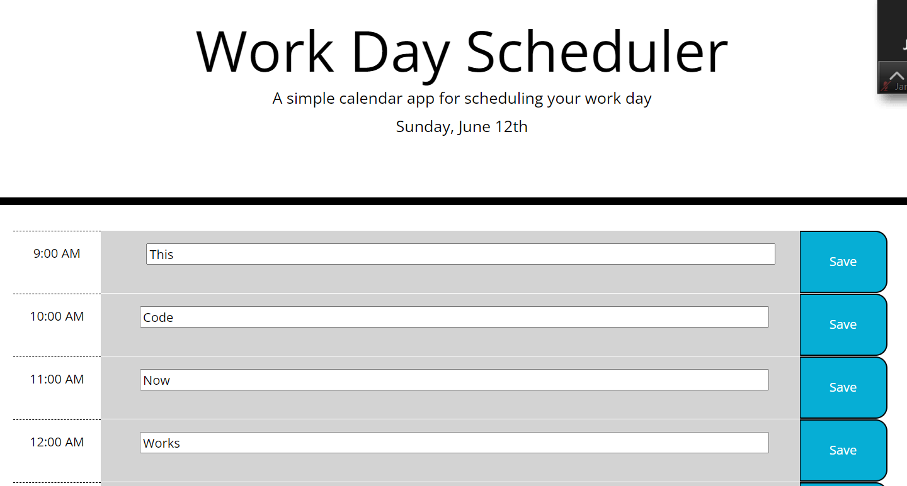

# work_day_scheduler

## Description

This application displays the current date and time at the top of the page,

and lets the user store text notes which will be saved even when the window is closed.

## Collaborators

Nicholas Jones

## Main Technologies

Javascript, moment.js

## Link

https://njscc.github.io/work_day_scheduler/

## Screenshot

